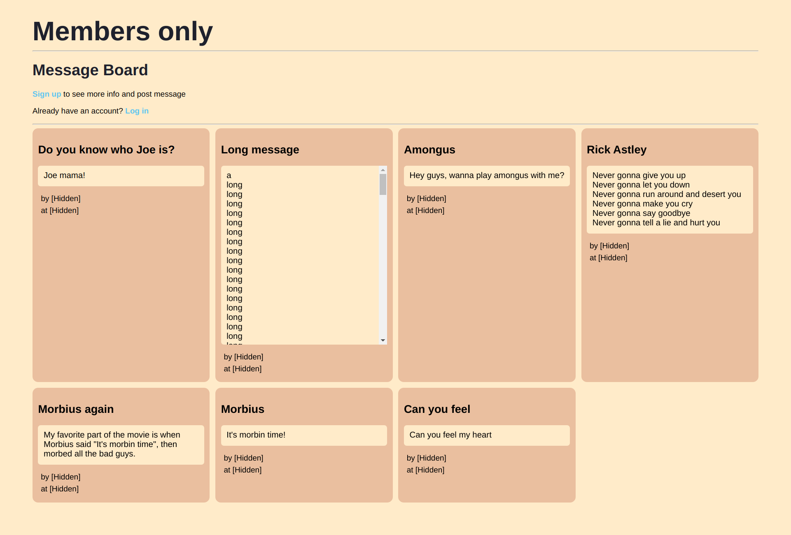
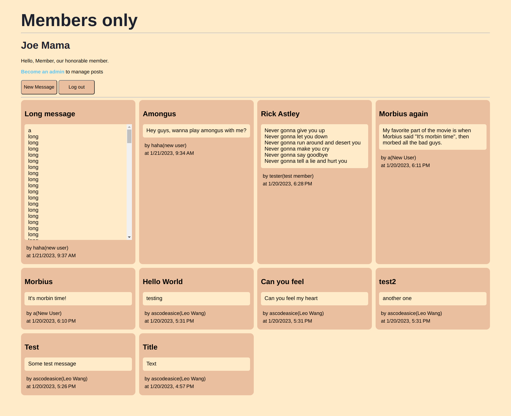
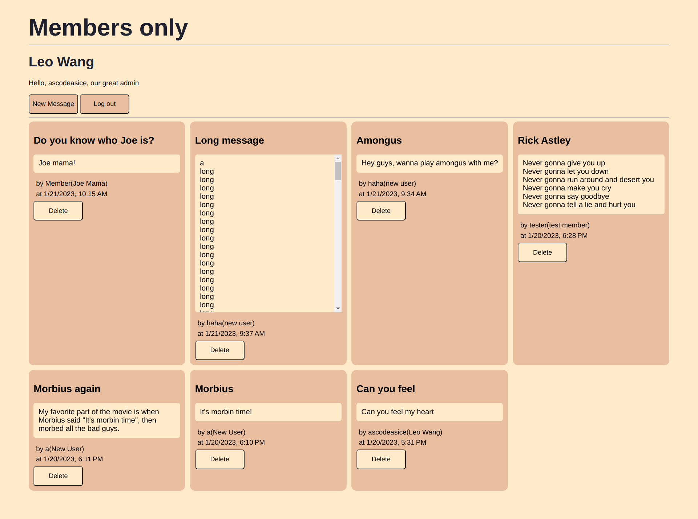

# members-only
A website that allows user gain more ability by logging in, and enter secret passwords.

There're three levels of users:
1. No account/ not-member
    
    You can't see author of messages or post message
2. Member

    You can see authors and post your own message

3. Admin

    You can delete others' messages

To become a member, enter "password" in the become member page.
As for the admin password, you will need to guess yourself.

This project is mainly to practice user authentication
# Details
- Use Express with pug for framework
- Use MongoDB for database
- Use bcryptjs for hashing password
- Use passportJS for user authentication
# Results
## Non-member View
You can't see authors and post message 

## Member View
You can see authors and post message

## Admin View
You can delete others' messages 

# Link
[Live Preview](https://members-only-ascodeasice.up.railway.app/)
Deploying on railway has a time limit(starter plan), so the link might not work.